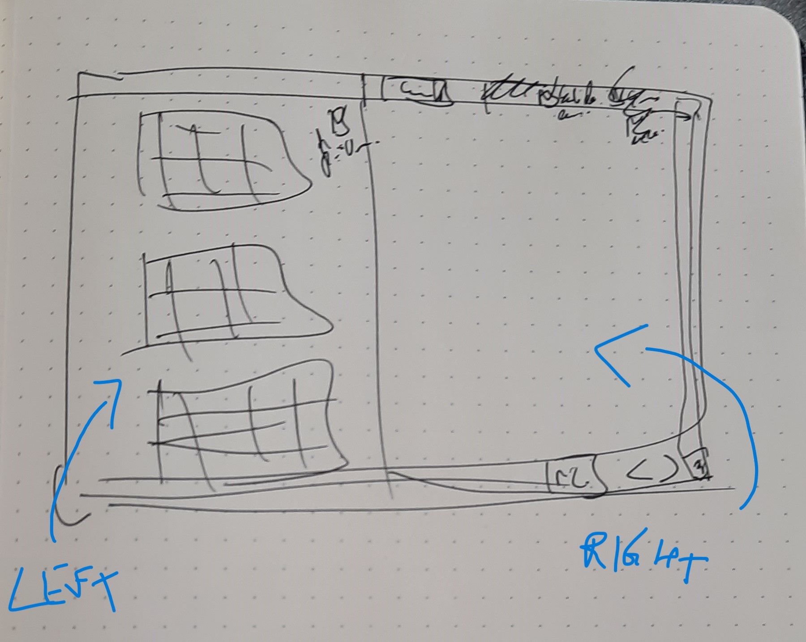

# **TODO**

**Heatmaps Categories UI**

## HEATMAPS CATEGORIES

* Variable names check-up / Clean code
* Reformat files
* Flatten Embedding activations (stop taking mean)
* Add max-diff into table
* Check heatmap difference (may not be computing the actual differences)
* Add label of layer's name above heatmaps on the left side
* Loading window
* Develop the right side of the UI

## HEATMAPS SAMPLE